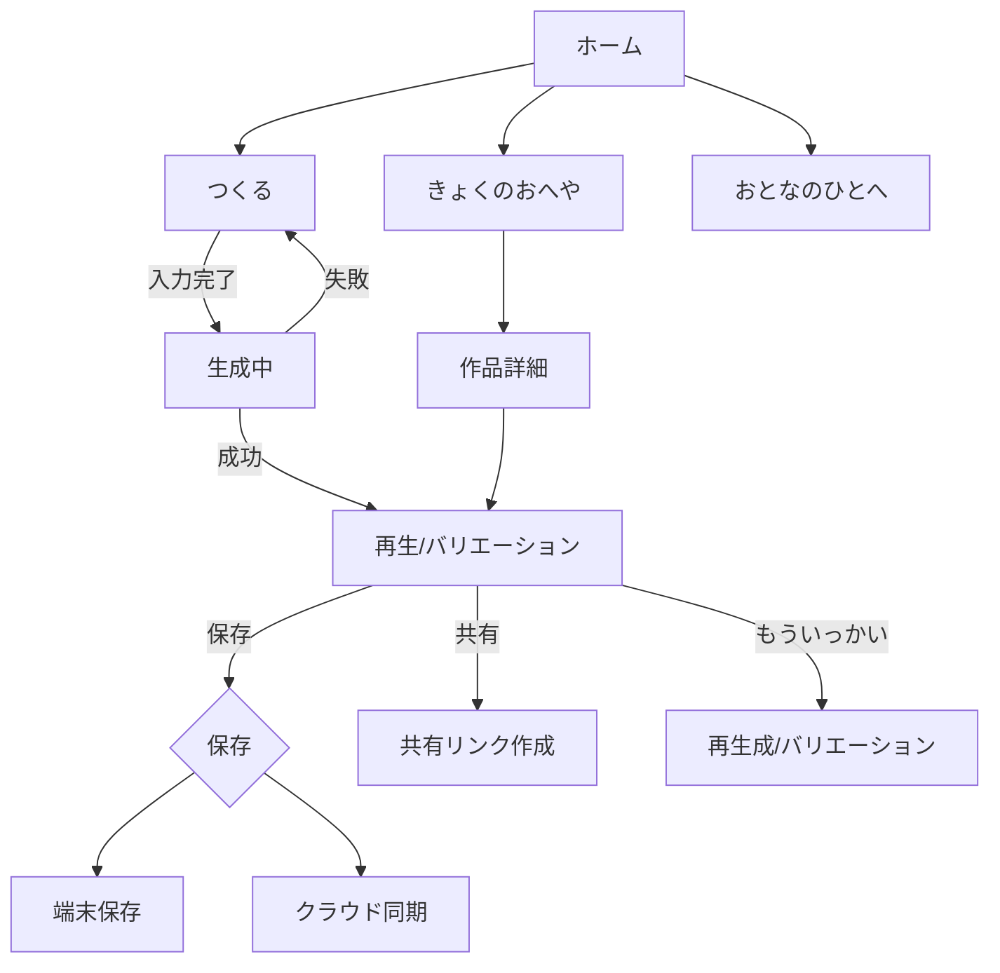

# ソフトウェア要求仕様書（SRS）

**製品名（仮）**: PochiPochi Composer
**版**: v0.9-draft
**作成日**: 2025-08-08
**作成者**: —

---

## 1. 目的

幼児が「ワンフレーズ」と「どんなイメージか（絵・ことば・スタンプ）」を入力すると、プロのミュージシャンのようにその場で曲へふくらませ、短い完成曲（例: 30〜60秒）として再生・保存できる“子ども向け”生成音楽アプリを実現する。

## 2. スコープ

* 対象プラットフォーム: iOS/Android（優先）、将来的にWeb。
* 対象年齢: 3〜7歳（保護者同伴を前提）。
* MVP出力: インストゥルメンタルの短尺曲と効果音の自動アレンジ。将来は簡易歌詞と合成ボーカルをオプション化。

## 3. 用語定義

* **ワンフレーズ**: 1〜4小節のメロディ（ステップ入力またはハミング）。
* **イメージ入力**: 画像/ステッカー/単語/絵文字で表す“曲の雰囲気”。
* **アレンジ/ふくらませ**: 伴奏生成、構成化（A/A'など）、音色とリズムの選定、ミックスの自動化。
* **セーフティガード**: 有害語・個人情報・録音コンテンツの不適切判定とブロック。

## 4. ペルソナ

* **子どもユーザ（主）**: 4歳、タップで音を置ける。文字は苦手。
* **保護者**: コンテンツ管理、共有、購入、同意（録音許可等）。
* **制作側運用者**: 楽曲テンプレ、効果音パック管理、ガバナンス。

## 5. ユースケース（主要）

1. 子どもが8×8の音階グリッドで音をポチポチ。
2. ステッカー（例: ねこ/だいぼうけん/ねむい）を選ぶ。
3. 「つくる」→ 3〜7秒でストリーミング再生開始。
4. 気に入らなければ「もういっかい」でバリエーション生成（同メロディ）。
5. 保護者が保存、家族内共有リンクを発行。

## 6. システム概要

クライアントは入力収集と即時プレビュー、バックエンドは「メロディ条件付き音楽生成」「サウンドデザイン」「ミックスダウン」「安全性判定」を担う。生成はストリーミング対応。MIDIベースの中間表現で可逆編集可能とする。

## 7. 機能要件

### 7.1 ワンフレーズ入力

* F-1: 8×8グリッド（音高×拍）でのタップ入力。量子化: 1/8拍、長さは1〜4小節。
* F-2: ハミング録音（MVP外でも可）。オンデバイスで音高推定、MIDI化。
* F-3: テンポ（80〜160 BPM）と調（C/G/Fなど5種のプリセット）選択。

### 7.2 イメージ入力

* F-4: ステッカー/絵文字/単語を最大3個まで選択。
* F-5: 子ども語→音楽属性マッピング（例: 「ねこ」→ 軽快/ピッツィカート、「ねむい」→ スロー/ローパス）。

### 7.3 プロンプトビルダー

* F-6: 入力メロディ（MIDI）とイメージ属性から、ジャンル/編成/拍子/コード進行/ドラムパターン/音色を決定する内部プロンプトを生成。
* F-7: 年齢に応じたラウドネスと周波数帯域を制限（耳保護）。

### 7.4 作曲・編曲エンジン

* F-8: メロディ条件付き生成モデルで伴奏と構成を生成。基本構成: Intro(1小節) + A(4) + A'(4)。
* F-9: 調とスケール外音の自動補正。
* F-10: 3バリエーション生成（同一メロディ、アレンジ差）。

### 7.5 オーディオ生成・再生

* F-11: 低遅延プレビューをHTTPストリーミング。再生開始までの目標TTFP 3秒以下。
* F-12: 完全版レンダリング（最長60秒、WAV 44.1kHz/16bit、端末保存はAAC/MP3）。
* F-13: 音量ノーマライズ（-16 LUFS目標）。

### 7.6 コンテンツ安全性

* F-14: 不適切語/PII/録音内ノイズの検知。ブロック時は子ども向け文言で再入力誘導。
* F-15: 共有時は保護者ゲート（簡易年齢確認/端末PIN）。

### 7.7 保存・共有

* F-16: 端末ローカル保存（権限必須）。
* F-17: 家族内共有リンク（有効期限7日、閲覧のみ）。
* F-18: クラウド同期（任意、匿名ID）。

### 7.8 プリセット/教材

* F-19: 「はじめてパック」（固定メロディの分解学習）。
* F-20: 週替わりお題（サーバ設定で更新）。

### 7.9 保護者ダッシュボード

* F-21: 作品一覧、視聴履歴、保存容量表示。
* F-22: 端末内の録音データ自動削除日数の設定（既定30日）。

## 8. 非機能要件

* **性能**:

  * NFR-1: 90パーセンタイルでプレビュー開始3秒以内、完全版30秒以内。
  * NFR-2: 同時生成100セッションでSLA継続。
* **可用性**: 月間稼働率 99.5%以上。
* **セキュリティ/プライバシー**:

  * NFR-3: 個人識別情報は既定で収集しない。録音は端末内処理を優先。
  * NFR-4: 共有リンクは匿名、期限付き、アクセスログ最小化。
* **アクセシビリティ**:

  * NFR-5: ボタン48dp以上、文字最小16sp、コントラスト比 4.5:1 以上。
* **国際化**: 日本語を既定。英語は将来。音階表示はドレミ/ABC切替。
* **端末要件**: iOS 16+/Android 10+、メモリ4GB以上推奨。

## 9. 外部インターフェース要件

### 9.1 UI（MVP画面）

1. ホーム: 「つくる」「きょくのおへや」。
2. つくる: グリッド入力、テンポ/調、イメージステッカー。
3. 生成中: アニメーション＋進捗。
4. 再生: バリエーション切替、保存、もういっかい。
5. 保護者: 作品一覧、共有、設定。

### 9.2 API（サンプル）

* `POST /v1/generate`

  * 入力: melody(MIDI JSON), prompt(tags\[]), tempo, key
  * 出力: streamId, previewUrl, jobId
* `GET /v1/generate/{jobId}`

  * 出力: status, audioUrl, meta

## 10. データ要件

* **メロディ**: MIDI相当JSON（tick, pitch, duration, velocity）。
* **楽曲メタ**: key, bpm, scale, structure, instruments。
* **保存**: 作品ID、生成日時、端末内パス。クラウドはハッシュ化IDのみ。
* **保持**: クラウド音源は7日後自動削除（再生成可）。

## 11. アーキテクチャ

* クライアント: React Native + ネイティブオーディオ（ExoPlayer/AVAudioEngine/AudioKit等）。
* バックエンド: API Gateway → Orchestrator → 生成ワーカー（音楽生成モデル、ミキサー）→ オブジェクトストレージ → CDN。
* 生成モデル層: 「メロディ条件付き音楽生成」「ドラムパターン自動化」「スタイル転写」。将来: 歌詞生成LLM、ボーカロイド相当TTS。
* 監視: メトリクス（TTFP、成功率、生成長さ）、ログ、トレース。

## 12. 安全性/コンプライアンス

* 子ども向けUI: 誘導広告/外部リンクは既定で無効。
* 録音権限は明示リクエスト、音声は端末内解析を既定。
* 不適切コンテンツ検出: NGワード辞書＋音響イベント分類器。
* 保護者ゲート: 連続タップ式クイズ/端末PIN。

## 13. テスト計画（要約）

* 単体: プロンプトマッピング、音階補正、API I/F。
* 結合: 生成→ストリーミング→保存の一連。
* 性能: 100同時生成時のTTFP、スループット。
* 品質: 自動可聴テスト（ラウドネス、クリッピング、無音率）。
* 受入: ユーザーストーリー別のUATチェックリスト（§15）。

## 14. 制約・前提

* 生成モデルの一部は外部APIまたは専用GPUサーバを使用。
* 一部端末ではハミング→MIDI変換を無効化（性能不足時）。

## 15. 受入基準（抜粋）

* AC-1: 4歳児が介入少なく8×8グリッドで1小節以上を入力できる。
* AC-2: 「つくる」タップから3秒以内に音が鳴り始める（90p）。
* AC-3: 調/テンポの変更が即時に反映される。
* AC-4: 保存した曲は機内モードでも再生できる。
* AC-5: 共有リンクは期限切れ後にアクセス不可。
* AC-6: 不適切入力は子ども向けメッセージでリトライ誘導。

## 16. ロードマップ

* **MVP**: グリッド入力、タグ→アレンジ、プレビュー/保存/共有、セーフティ基本。
* **MVP+1**: ハミング→MIDI、プリセット教材、週替わりお題。
* **MVP+2**: 簡易歌詞＆コーラス、ステム書き出し、Web版。

## 17. 付録A: タグ→音楽属性マッピング例

| タグ     | BPM | スケール | ドラム   | 楽器             | ミックス   |
| ------ | --: | ---- | ----- | -------------- | ------ |
| ねこ     | 112 | メジャー | ブラシ   | ピッツィカート弦, マリンバ | ハイを控えめ |
| だいぼうけん | 132 | ドリアン | タム多め  | ブラス, スネア       | 低域強調   |
| ねむい    |  80 | メジャー | なし/軽微 | エレピ, パッド       | ローパス微  |

## 18. 付録B: エラーメッセージ（子ども向け）

* 録音がしずらいよ → 「ちょっとだけ しずかにして、もういちど おねがい！」
* ネットがぷちぷち → 「ちょっとまってね。おんがくの じゅんびちゅう！」

## 19. UIフロー（MVP）

### 19.1 画面一覧

* **ホーム**: 「つくる」「きょくのおへや」「おとなのひとへ」
* **つくる**: 8×8グリッド、テンポ/調、イメージステッカー選択
* **生成中**: 進捗アニメーション、キャンセル
* **再生**: バリエーション切替、保存、共有、もういっかい
* **きょくのおへや**: 作品一覧、並び替え、詳細
* **作品詳細**: メタ表示、再生、共有、削除
* **おとなのひとへ（保護者）**: 共有設定、端末保存、削除ポリシー、アプリ情報

### 19.2 画面遷移



### 19.3 イベントとガード

* つくる→生成中: 入力バリデーション（小節長1〜4、音数<=64、BPM 80〜160、タグ<=3）。
* 生成中→再生: プレビューURLの受領と最小1秒分のバッファ取得。
* 再生→保存: ストレージ権限確認、失敗時は保護者ゲート経由でリトライ案内。
* 共有: 有効期限付きURL発行。保護者ゲート通過必須。

---

## 20. API定義（OpenAPI 3.1 / Draft）

```yaml
openapi: 3.1.0
info:
  title: PochiPochi Composer API
  version: 0.1.0
servers:
  - url: https://api.pochipochi.example.com
paths:
  /v1/generate:
    post:
      summary: メロディとタグから楽曲を生成し、プレビューを返す
      requestBody:
        required: true
        content:
          application/json:
            schema:
              $ref: '#/components/schemas/GenerateRequest'
      responses:
        '202':
          description: 生成開始。プレビューURL（ストリーミング）とジョブIDを返す
          content:
            application/json:
              schema:
                $ref: '#/components/schemas/GenerateResponse'
        '400': { $ref: '#/components/responses/BadRequest' }
  /v1/jobs/{jobId}:
    get:
      summary: 生成ジョブの状態確認
      parameters:
        - in: path
          name: jobId
          required: true
          schema: { type: string }
      responses:
        '200':
          description: ステータス取得
          content:
            application/json:
              schema:
                $ref: '#/components/schemas/JobStatus'
        '404': { $ref: '#/components/responses/NotFound' }
  /v1/variants:
    post:
      summary: 同一メロディでアレンジのみのバリエーションを生成
      requestBody:
        required: true
        content:
          application/json:
            schema:
              $ref: '#/components/schemas/VariantRequest'
      responses:
        '202':
          description: 生成開始
          content:
            application/json:
              schema:
                $ref: '#/components/schemas/GenerateResponse'
  /v1/presets:
    get:
      summary: テンポ/調/タグなどのプリセット取得
      responses:
        '200':
          description: プリセット一覧
          content:
            application/json:
              schema:
                type: object
                properties:
                  keys:
                    type: array
                    items: { type: string, enum: [C, G, F, Dm, Am] }
                  tempos:
                    type: array
                    items: { type: integer, minimum: 80, maximum: 160 }
                  tags:
                    type: array
                    items: { type: string }
  /v1/health:
    get:
      summary: ヘルスチェック
      responses:
        '200':
          description: ok
          content:
            application/json:
              schema:
                type: object
                properties: { status: { type: string, enum: [ok] } }
components:
  schemas:
    MelodyNote:
      type: object
      required: [pitch, start, duration]
      properties:
        pitch: { type: integer, minimum: 21, maximum: 108, description: 'MIDIノート番号' }
        start: { type: number, minimum: 0 }
        duration: { type: number, exclusiveMinimum: 0 }
        velocity: { type: integer, minimum: 1, maximum: 127, default: 96 }
    Melody:
      type: object
      required: [ppq, length, notes]
      properties:
        ppq: { type: integer, default: 480 }
        length: { type: number, description: '秒' }
        notes:
          type: array
          items: { $ref: '#/components/schemas/MelodyNote' }
    GenerateRequest:
      type: object
      required: [melody]
      properties:
        melody: { $ref: '#/components/schemas/Melody' }
        tempo: { type: integer, minimum: 80, maximum: 160, default: 112 }
        key: { type: string, enum: [C, G, F, Dm, Am], default: C }
        scale: { type: string, enum: [major, minor, dorian, mixolydian], default: major }
        tags:
          type: array
          maxItems: 3
          items: { type: string }
        seed: { type: integer, description: '生成の再現性用' }
        lengthSec: { type: integer, minimum: 10, maximum: 60, default: 30 }
    VariantRequest:
      type: object
      required: [jobId]
      properties:
        jobId: { type: string }
        seed: { type: integer }
        variationStrength: { type: number, minimum: 0, maximum: 1, default: 0.5 }
    GenerateResponse:
      type: object
      properties:
        jobId: { type: string }
        streamId: { type: string }
        previewUrl: { type: string, format: uri }
    JobStatus:
      type: object
      properties:
        status: { type: string, enum: [queued, running, previewing, complete, error] }
        progress: { type: number, minimum: 0, maximum: 1 }
        audioUrl: { type: string, format: uri }
        stems:
          type: array
          items: { type: string, format: uri }
        error: { type: string }
  responses:
    BadRequest:
      description: 入力不正
    NotFound:
      description: 見つからない
```

**備考**: プレビューはHTTPチャンクまたはHLSを想定。`previewUrl`は生成開始から3秒以内に再生可能となること（NFR-1）。

---

## 21. プロンプトマッピング単体テスト（TypeScript/Vitest想定）

### 21.1 対象モジュール

* `mapTagsToAttributes(tags: string[], tempo?: number, key?: Key): MusicalAttributes`
* `enforceKidSafeMix(mix: MixProfile): MixProfile`
* `quantizeAndClamp(melody: Melody, key: Key, scale: Scale): Melody`

### 21.2 期待仕様（抜粋）

* タグは最大3つ。未知タグは無視。競合タグは重み付けで解決（例: 「ねむい」優先でBPMを下げ、ただし「だいぼうけん」がある場合は下げ幅を半減）。
* 出力BPMは80〜160にクランプ。
* 子ども向けミックス: 8 kHz以上の高域を+0 dBを超えてブーストしない、短時間ラウドネスは-13 LUFSを超えない。
* 音階外音は最近傍音に吸着。

### 21.3 代表テストケース

```ts
import { describe, it, expect } from 'vitest'
import { mapTagsToAttributes, enforceKidSafeMix, quantizeAndClamp } from './prompt-mapper'

const Cmaj = { key: 'C', scale: 'major' } as const

describe('mapTagsToAttributes', () => {
  it('ねこ → 軽快、BPM=~112、ピッツィカート', () => {
    const r = mapTagsToAttributes(['ねこ'])
    expect(r.bpm).toBeGreaterThanOrEqual(104)
    expect(r.bpm).toBeLessThanOrEqual(120)
    expect(r.instruments).toContain('pizz_strings')
    expect(r.drumPattern).toMatch(/brush|light/)
  })

  it('ねむい → スロー、ドラム無し、ローパス', () => {
    const r = mapTagsToAttributes(['ねむい'])
    expect(r.bpm).toBeLessThanOrEqual(90)
    expect(r.drumPattern).toBe('none')
    expect(r.mix.lowpassHz).toBeGreaterThanOrEqual(2000)
  })

  it('だいぼうけん → 速め、ブラス/スネア強調', () => {
    const r = mapTagsToAttributes(['だいぼうけん'])
    expect(r.bpm).toBeGreaterThanOrEqual(124)
    expect(r.instruments).toContain('brass')
    expect(r.drumPattern).toMatch(/snare|toms/)
  })

  it('競合解決: ねむい + だいぼうけん → 中庸BPM', () => {
    const r = mapTagsToAttributes(['ねむい', 'だいぼうけん'])
    expect(r.bpm).toBeGreaterThanOrEqual(96)
    expect(r.bpm).toBeLessThanOrEqual(116)
  })

  it('未知タグは無視しつつ既知タグ適用', () => {
    const r = mapTagsToAttributes(['???', 'ねこ'])
    expect(r.instruments).toContain('pizz_strings')
  })

  it('タグ>3は切り詰め', () => {
    const r = mapTagsToAttributes(['ねこ', 'ねむい', 'だいぼうけん', 'さかな'])
    expect(r.usedTags.length).toBeLessThanOrEqual(3)
  })
})

describe('enforceKidSafeMix', () => {
  it('高域ブースト過多を制限', () => {
    const r = enforceKidSafeMix({ trebleGainDb: +6, lowpassHz: 20000, loudnessLUFS: -10 })
    expect(r.trebleGainDb).toBeLessThanOrEqual(0)
    expect(r.loudnessLUFS).toBeGreaterThanOrEqual(-16)
    expect(r.lowpassHz).toBeLessThanOrEqual(8000)
  })
})

describe('quantizeAndClamp', () => {
  it('スケール外音を最近傍音へ吸着', () => {
    const melody = { ppq: 480, length: 4, notes: [{ pitch: 61, start: 0, duration: 0.5 }] }
    const r = quantizeAndClamp(melody as any, Cmaj.key as any, Cmaj.scale as any)
    // D#(63)などがCメジャーでは許されない → 近傍のD(62)かE(64)へ
    const allowed = [60, 62, 64, 65, 67, 69, 71]
    expect(allowed).toContain(r.notes[0].pitch)
  })

  it('ノート数>64はエラー', () => {
    const notes = Array.from({ length: 80 }, (_, i) => ({ pitch: 60, start: i * 0.25, duration: 0.25 }))
    expect(() => quantizeAndClamp({ ppq: 480, length: 8, notes } as any, 'C' as any, 'major' as any)).toThrow()
  })
})
```

### 21.4 テストデータ（JSONベクトル例）

```json
{
  "case": "ねこ_基本",
  "input": { "tags": ["ねこ"], "tempo": null, "key": "C" },
  "expect": {
    "bpmRange": [104, 120],
    "instrumentsContains": ["pizz_strings", "marimba"],
    "mixMaxTrebleDb": 0
  }
}
```

### 21.5 計測指標（CIで失敗条件）

* 90p で `mapTagsToAttributes` の実行時間 < 5 ms（Node 18, リリースビルド）。
* テストカバレッジ: ステートメント 85% / ブランチ 80% 以上。
